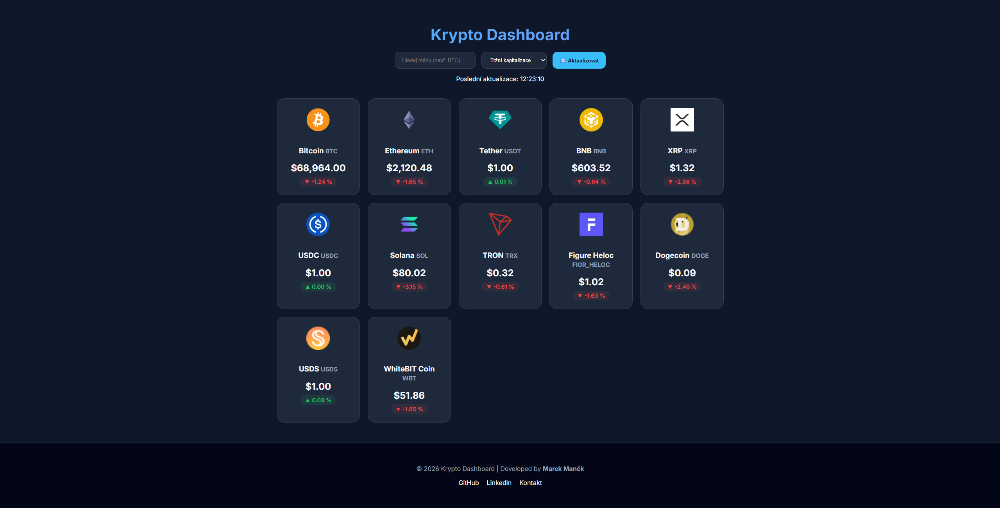

# 🚀 Krypto Dashboard

Moderní webová aplikace pro sledování aktuálních cen kryptoměn v reálném čase. Projekt je postaven na čistém JavaScriptu bez použití frameworků, s důrazem na výkon, čistý kód a uživatelský zážitek (UX).



## 🌟 Klíčové vlastnosti

* **Real-time Data:** Načítání aktuálních cen, tržní kapitalizace a 24h změn z CoinGecko API.
* **Skeleton Loading:** Moderní indikátor načítání pro plynulý uživatelský dojem.
* **Dynamické vyhledávání:** Okamžité filtrování mincí podle jména nebo symbolu (např. BTC).
* **Pokročilé řazení:** Možnost seřadit měny podle ceny, růstu nebo tržní kapitalizace.
* **Responzivní Design:** Plně optimalizováno pro mobilní zařízení, tablety i širokoúhlé monitory pomocí CSS Grid.
* **Dark Mode:** Moderní tmavé rozhraní s důrazem na čitelnost dat.
* **Persistence:** Ukládání času poslední aktualizace do `localStorage`.

## 🛠️ Použité technologie

* **HTML5** – sémantická struktura prvků.
* **CSS3** – Custom Properties (proměnné), CSS Grid, Flexbox a animace.
* **Vanilla JavaScript (ES6+)** – Fetch API, asynchronní programování (async/await), manipulace s DOMem, Array metody (map, filter, sort).

## 🚀 Jak aplikaci spustit

1. Naklonujte si tento repozitář:
   ```bash
   git clone [https://github.com/tve-jmeno/krypto-dashboard.git](https://github.com/tve-jmeno/krypto-dashboard.git)

2. Otevřete soubor index.html ve vašem prohlížeči.
3. Poznámka: Doporučuji použít rozšíření "Live Server" ve VS Code pro nejlepší zážitek.

## 📈 Co jsem se na projektu naučil?
Tento projekt byl zaměřen na procvičení klíčových konceptů front-end vývoje:
1. **Práce s API**: Ošetření chybových stavů (Rate limiting, síťové chyby) pomocí try/catch bloků.
2. **UX vzorce**: Implementace Skeleton screenu, který zabraňuje nepříjemnému "probliknutí" obsahu při načítání.
3. **Optimalizace výkonu**: Efektivní manipulace s DOMem a formátování čísel pomocí mezinárodního API Intl.NumberFormat.

## 📄 Licence
Tento projekt je open-source a volně k dispozici.

Vyrobil Marek Maněk - 2026
